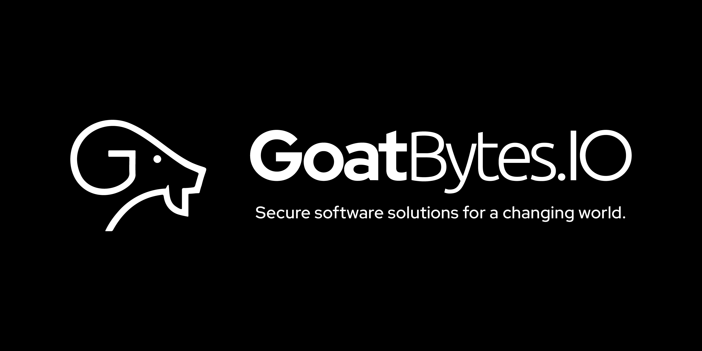

<h1 align="center">ElasticKtDSL</h1>
<p align="center">Elastic Search Kotlin Domain System Language (DSL)</p>
<p align="center">
  <a href="https://styles.goatbytes.io/lang/kotlin" rel="nofollow"></a>
  &nbsp;
<a href="https://central.sonatype.com/namespace/io.goatbytes">
-%230037FF?style=flat-square&logo=gradle" alt="Gradle Dependency" />
</a>
  &nbsp;
  
</p>

## Getting Started

### Gradle

Add the following to your `build.gradle.kts` in your project:

```kotlin
dependencies {
  implementation("io.goatbytes:elasticktdsl:1.0.0-alpha+2024050723.c7c422e")
}
```

## Examples and Documentation

### Term Query

JSON:

```json
{
  "term": {
    "user": "goatbytes"
  }
}
```

Kotlin:

```kotlin
val query = term {
  "user" to "goatbytes"
}
```

### Bool Query

JSON:

```json
{
  "bool": {
    "must": {
      "term": {
        "user": "goatbytes"
      }
    },
    "filter": {
      "term": {
        "tag": "tech"
      }
    },
    "must_not": {
      "range": {
        "age": {
          "from": 10,
          "to": 20
        }
      }
    },
    "should": [
      {
        "term": {
          "tag": "wow"
        }
      },
      {
        "term": {
          "tag": "elasticsearch"
        }
      }
    ],
    "minimum_should_match": 1,
    "boost": 1.0
  }
}
```

Kotlin:

```kotlin
val query = bool {
  must {
    term { "user" to "goatbytes" }
  }
  filter {
    term { "tag" to "tech" }
  }
  must_not {
    range {
      "age" {
        from = 10
        to = 20
      }
    }
  }
  should = listOf(
    term { "tag" to "wow" },
    term { "tag" to "elasticsearch" })
  minimum_should_match = 1
  boost = 1.0f
}

```

### Function Score Query

JSON:

```json
{
  "function_score": {
    "query": {
      "match_all": {}
    },
    "functions": [
      {
        "filter": {
          "term": {
            "foo": "bar"
          }
        },
        "gauss": {
          "baz": {
            "scale": 1.0
          }
        }
      },
      {
        "filter": {
          "match_all": {}
        },
        "random_score": {
          "seed": 234
        }
      },
      {
        "exp": {
          "qux": {
            "scale": 2.3
          }
        }
      }
    ],
    "score_mode": "max",
    "boost_mode": "multiply",
    "max_boost": 5.0,
    "boost": 1.2,
    "min_score": 0.001
  }
}
```

Kotlin:

```kotlin
val query = function_score {
  query = match_all { }
  functions = listOf(
    term { "foo" to "bar" } to gaussDecayFunction("baz", 1.0),
    match_all { } to randomFunction(234L),
    null to exponentialDecayFunction("qux", 2.3))

  boost = 1.2f
  boost_mode = "multiply"
  score_mode = "max"
  max_boost = 5.0f
  min_score = 0.001f
}
```

See the src/test directory for more examples.

## Contributing

This project is a community-driven fork of the original ES Kotlin library by Michael Buhot, which
provides a Kotlin-flavored DSL for constructing Elasticsearch queries. The original library aimed to
minimize the gap between the Elasticsearch JSON query DSL and the API used when writing Kotlin
applications, integrating seamlessly with the existing Java API to provide a more Kotlin-idiomatic
syntax.

The original repository for ES Kotlin is available at: [mbuhot/eskotlin](eskotlin). It was
previously hosted on Bintray, which has since been discontinued. This fork aims to continue the
development and support of ES Kotlin as an open-source project under the same MIT license.

Contributions are welcome! Please read our [contributing guide](CONTRIBUTING.md) and submit pull
requests to our repository.

## License

This project is licensed under the MIT License - see the [LICENSE](LICENSE) file for details.

## ℹ️ About GoatBytes.IO <a name="about"></a>



<p align="center">
<a href="https://github.com/goatbytes" target="_blank">
    
</a>
<a href="https://twitter.com/goatbytes" target="_blank">
    
</a>
<a href="https://www.linkedin.com/company/goatbytes" target="_blank">
    
</a>
<a href="https://www.instagram.com/goatbytes.io/" target="_blank">
    
</a>
</p>

At **GoatBytes.IO**, our mission is to develop secure software solutions that empower businesses to
transform the world. With a focus on innovation and excellence, we strive to deliver cutting-edge
products that meet the evolving needs of businesses across various industries.

[eskotlin]: https://github.com/mbuhot/eskotlin